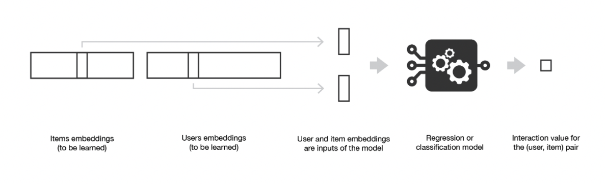

# Recommender-System
End-To-End implementation of Recommendation System built using MovieLens Dataset

During the last few decades, with the rise of Youtube, Amazon, Netflix and many other such web services, recommender systems have taken more and more place in our lives. From e-commerce (suggest to buyers articles that could interest them) to online advertisement (suggest to users the right contents, matching their preferences), recommender systems are today unavoidable in our daily online journeys.
In a very general way, recommender systems are algorithms aimed at suggesting relevant items to users (items being movies to watch, text to read, products to buy or anything else depending on industries).
Recommender systems are really critical in some industries as they can generate a huge amount of income when they are efficient or also be a way to stand out significantly from competitors. As a proof of the importance of recommender systems, we can mention that, a few years ago, Netflix organised a challenges (the “Netflix prize”) where the goal was to produce a recommender system that performs better than its own algorithm with a prize of 1 million dollars to win.

# Types Of Recommender Systems

1. Collaborative Filtering Models
The basic idea of collaborative filtering methods is that these unspecified ratings can
be imputed.
Leverage either inter-item correlations or inter-user correlations for the prediction
process. Some models also use both types of correlations. Two types of methods that are commonly used in collaborative filtering:
### Memory-based method/neighborhood-based collaborative filtering algorithms:
Ratings of user-item combinations are predicted on the basis of their neighborhoods.
These neighborhoods can be defined in one of two ways:

i) User-based Collaborative filtering: The ratings provided by the like-minded users
of a target user A are used in order to make the recommendations for A.

ii) Item-based collaborative filtering: To make the rating predictions for target item
B by user A, the first step is to determine a set S of items that are most similar to
target item B.

Item-based methods provide more relevant recommendations because of the fact
that a user’s own ratings are used to perform the recommendation.
Memory-based techniques are simple to implement and the resulting recommendations are
often easy to explain

### Model-based Methods: 
Machine learning and data mining methods are used in the
context of predictive models.
Examples: Decision trees, Rule-based models, Bayesian methods and latent factor models.

2. Content-Based Recommender Systems

Content-based systems are dependent on two sources of data:

● Description of various items in terms of content-centric attributes.

● User profile, which is generated from user feedback about various items.

Used in scenarios in which a significant amount of attribute information is available at hand.

### How do Content Based Recommender Systems work?

● Preprocessing and feature extraction

● Content-based learning of user profiles

● Filtering and recommendation

3. Hybrid Models 

Use both Content Based and Collabrative Filtering techniques to get the best results.

# The Functionalities Implemented in the Recommender System

1. Acquiring Data
2. Augmenting Data with more data fields from IMDB or TMDB data
3. Refine the data by creating the items, users and interaction matrix

- **Items**: item id + metadata features
- **Users**: User id + metadata features
- **Interaction**: Explicit Matrix, Implicit Matrix
 4. Transform

Prepare the data for using Deep Learning algorithms. There are two main transformations:

- **Preprocessing**:
    - Users: Convert to label encoded values
    - Items: Convert to label encoded values
    - User Side Features: Convert to 
    - Ratings: Convert the interaction to Explicit or Implicit signals

- **Data Spliting**: Create train & test datasets for evaluating the dataset
    - Random Split
    - Stratified Split
    - Chronological Split

5. Evaluation Metrics

Prediction Metrics (Similiar to Regression Problem)
    - RMSE
    - MSE
    - MAE
    
6. Building Model 
7. Matrix Factorization Linear with Bias
8. Non-negative Matrix Factorization
9. Deep Matrix Factorization
10. Deep Neural Collabrative Filtering
    
    

